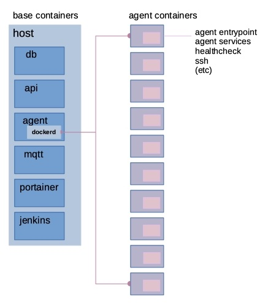

Architecture and Rationale
--------------------------

This is a microservices architecture to run Canonical's Testflinger service. A full-featured Docker architecture posses the following highlighted features (and supporting rationale):

- Testflinger agents run in individual, discrete containers denoted by the associated SUT name in the Needham lab environment. These are lightweight containers, allowing for dynamic healthchecking, reporting and operations. As there is no shared agent-level operating system, this creates complete segmentation from the other agents, which avoids the pitfalls to running agents via a shared systemctl/systemd. Operationally, this also allows for easy healthcheck integration and allows for the utilization of Portainer for container status and management.

- Testflinger agents have a dedicated operating system for installing dependancies and other testing specific resources specific to that agent only - sidestepping conflicts seen in a shared environment. Reseting to a clean slate is trivial after testing is complete, as the container operating system uses ephermal storage (shared, persistent storage is also utilized for Testflinger data).

- Docker compose is utilized for fully automated deployment of the entire stack, allowing for extreme portability. The base container infrastructure is defined via a master Docker compose file, which will deploy the entire environment automatically upon docker-compose deploy invokation. This allows for single-shot deployments of entire environment.

- Agent containers are dynamically created via a full-fledged implimentation of the Docker API. This allows for dynamic container creation, which is triggered by the presence of Testflinger configuration files in the associated base directory. Agent container images are created if not present.

- The agent container entrypoint runs non-blocking operations which push out-of-band logging, and sends health status to the stack MQTT broker and facilitates other operations. This enables dynamic status of the agent container while other operations take place within the agent container.

- An MQTT broker is part of the core stack, which allows for a multitude of opersations, visibility and reporting. Every agent communicates with this broker. Each agent utilizes bi-directional communication with this MQTT broker, allowing for jobs to be initiated via an MQTT publish.

- A Jenkins container is runninig in the enviroment. One pipeline per SUT in the lab, which has multi-stage granularity and progress. This is a hostname context environment, with each host having its own agent and pipeline. This architecture may change in the future.

In summary, this enviroment allows for high-availability, automated scaling and thourough reporting. Agent status is easily exposed and operations are trivial to perform via interfaces like Portainer. As this is a Docker only architecture, interdependancies are eliminated on the infrastructure layer. This allows for a consistent and reliable infrastructure. 

Visualizations and architecture specifics
-----------------------------------------

The Docker environment is laid as out as below:

The base layer comprises of the core agent infrastructure containers, as defined in the root Docker compose file.
Of note is the agent master continer named tf-agent. This container has access to the Docker daemon (dockerd) running on the Docker host. This allows for pseudo-nested (Docker-in-Docker) operations, creating an additional layer for every Testflinger agent container. This enables Testflinger agents to be dynamically created by the tf-agent container, via the Docker API. This is enables agents to be spun-up when named agent configuration files are added to the 'sut' subdir.

Each 'SUT agent' is a container instance with the following functions:

.. image: doc/sut_agent.jpg

The agent entrypoint is run at container invokation, and spawns a minimal, custom init. SSH access is for remote access and Jenkins agent comms. Agent routines are classes/methods/functions running on each instance (agent_entrypt.py).

The MQTT broker facilitates agent logging, said healthchecks and allows for initiating Testflinger jobs via MQTT publish.

.. image:: doc/mqtt.jpg

As stated above, healthchecks run on each agent container and report through this MQTT broker, via the 'agent' topic. These healthchecks are exposed via Docker native healthchecking, making it available for standard Docker reporting. Healthy/unhealthy status can be set by a multitude of conditions. MQTT topic details are listed in the container specifics section below.

Container management is facilitated via Portainer, which is deployed as part of the base Docker compose configuration. Full container management and health checking is availble from the Portainer web interface.

Docker Containers
-----------------

All container dockerfiles are located in the project root.

tf-agent
~~~~~~~~

Creates, starts and coordinated SUT agent containers.

- Runs a customized Phusion/Baseimage (Docker optimized Ubuntu) image.

- Runs nested Docker to enable containers to be created and spun up via the
  Docker API at tf-agent startup.

- Performs agent creation and management.

- On first startup, will create agent image and create each agent
  container. Uses the Docker daemon from the base Docker host (passes thru
  /var/run/ docker.sock).

\<sut_name\_\>
~~~~~~~~~~~~~~

Discrete container for each SUT agent. Runs testflinger-agent.

- One container per sut agent.

- Runs a customized Phusion/Baseimage (Docker optimized Ubuntu) image.

- Runs custom threaded subprocess pipe instrumentation (agent_entrypoint),
  logging to stdout, file and MQTT

- Runs a healthcheck script to facilitate Docker healthchecks via MQTT.

tf-cli
~~~~~~

Standard testflinger cli build, using Docker.

- Runs a customized Phusion/Baseimage (Docker optimized Ubuntu) image.

tf-api
~~~~~~

Gunicorn, with gevent.

tf-db
~~~~~

Redis database container.

tf-mqtt
~~~~~~~

Stack MQTT broker.

tf-portainer
~~~~~~~~~~~~

Portainer container for managing the stack and related agents.

- Needham Portainer details below.

nh-jenkins
~~~~~~~~~~

Runs the Jenkins instance to facilitate regression testing via Jenkins
pipelines. Pipelines are multi-stages to

Files of interest and project notes
-----------------------------------

-  ./code/init_agent_cntnrs

   -  Utilizes the Python Docker sdk to enable containers to be created
      and spun up via the dockerd api at tf-agent startup.
   -  Creates all sut container properties and attributes.
   -  Image creation (streams build).
   -  Network and network config.
   -  Host config with defined mounts for all files.
   -  Mounts are used for consistent scaling across many containers.
   -  Agent healthcheck (using MQTT).
   -  Containers instantiated via iterating over the sut conf dir in the
      project root.
   -  Agent container image is created ifit doesn't exist.
   -  Agent containers are created if they do not exist.

-  ./code/agent_entrypoint

   -  Loaded at agent container startup.

   -  Runs custom threaded subprocess pipe instrumentation.

   -  Logging to stdout, file and MQTT.

   -  Transmits agent output to stack MQTT broker.

   -  Runs agent_healthcheck.py (as below).

   -  Published MQTT topics:

      - agent

      - agent/logger status c3

      - current status of REST comms from agent to C3 output

      - current agent output (broker retained) submit_status

      - when active, lists topic to publish test cmd last_job

      - last job seen by the sut agent (broker retained)

-  ./code/agent_healthcheck

   -  Uses a simple MQTT subscribe poll on the (sut)/agent topic.

      -  Agent status is a looping timer thread that runs parallel to
         agent logging.
      -  If agent_entrypoint hangs or terminates/crashes, the container
         health will report as unhealthy.

   -  Runs at a set interval as defined within init_agent_cntnrs

      -  This is directly relative to the agent status timer period.
      -  Status timer period should overlap with healthcheck interval
         and timeout.

   -  Notes on the agent status reporting for the healthcheck:

      -  Relies on the fact that the logging thread is the parent of the
         status thread.

         -  Status child thread sets daemon=True, so if/when the parent
            thread fails, the child will follow suit and 'ok' messages
            will no longer be sent.

      -  Healthcheck parameters in init_agent_cntnrs detail:

         -  timeout should be => than status timer tperiod (or)
         -  retries should be increased if timeout donesn't cover status
            timer tperiod.

-  ./code/start_submit_agents

   -  Runs on testflinger-cli.

   -  Starts lightweight sut agents, similar to start_sut_agents.

   -  The "submit_status" topic will list instructions if the submit
      agent is ready.

   -  These agents listen for test submissions via MQTT, will then start
      the appropriate job. See MQTT notes below for useage.

   -  Subscribed MQTT topics: submit : listen for mqtt test_cmd message,
      initiate job.

-  ./code/01_run_sut_agents

   -  Starts init_agent_cntrs via init on tf-agent.

-  ./code/01_run_submit_agents

   -  Starts submit agents on testflinger-cli boot.

-  ./code/export_ssh_pubkey (and export_ssh_pubkey_agnt)

   -  Pushes ssh keys to specified stack MAAS host for maas-cli api.
   -  Runs on container boot, will not push key if it already exists.

-  ./reference.yaml

   -  Reference device agent file to facilitate job pushing via MQTT.

-  ./tf-entrypoint

   -  Runs on testflinger-agent.
   -  Exports ssh keys and starts init.

-  ./container-entrypoint

   -  Starts appropriate microservices, see below for more info.

-  ./tools/\*

   -  Contains convenience scripts for streamlined Docker ops.
   -  Most used scripts:: deploy_stack.sh : complete, clean deployment
      of stack orb_nuke.sh : completely destroy stack and all associated
      files and data reroll.sh : completely destroy stack, git pull and
      redeploy (git repo optional)

-  ./code/start_sut_agents (depreciated)

   -  Runs on testflinger-agent.
   -  Starts all agents, and performs logging.
   -  Transmits agent output to stack MQTT broker.
   -  Logs agent output /var/log/sut-agent within testflinger-agent.
   -  Developer notes and aspirations within source file.
   -  Published MQTT topics:: agent : agent/logger status c3 : current
      status of REST comms from agent to C3 output: current agent output
      (broker retained) submit_status : when active, lists topic to
      publish test cmd last_job : last job seen by the sut agent (broker
      retained)

Stack Operations
----------------

-  Starting and stopping the entire stack (including SUT agents):

   -  Log into the Docker host and execute (as appropriate)::

        docker-compose start (container name) docker-compose restart
        (container name) docker-compose stop (container name)

   -  Alernatively, reboot the Docker host.

      -  Stack will stop cleanly on shutdown and start on boot.

-  Starting and stopping SUT agents and/or individual stack containers:

   -  Log into the Docker host OR tf-agent (for SUT agents) and execute:

      -  Starting/Restarting/Stopping from shell::

           docker start (container name)
           docker restart (container name)
           docker stop (container name)

      -  Starting/Restarting/Stopping from Portainer works as well.

         -  Done via GUI; refer to Portainer notes below.

-  Checking container logs:

   -  On the shell of the Docker host::

        docker logs (container name)
        docker-compose logs (for contiguous view of stack container logs)

   -  In Portainer (in the containers context):

      - Click on the "(page icon)" (leftmost icon) under "Quick actions."
        OR

      - Click on the container name and select "(page icon) Logs."

-  Entering a container's console/shell:

   -  On the shell of Docker host::

        docker exec -it (container name)
        bash

   -  In Portainer (in the containers context):

      -  Click on the console prompt icon.

-  Changing/updating an agent's config:

   -  Enter the agent container's console (either method as above):

      -  Agent conf file path is
         ``/data/testflinger-agent/sut/(sut_name).conf``

      -  Edit the file, save and restart the agent container (as above).

      -  Conf file will reload on restart.

-  Adding an agent container:

   -  On the Docker host, in the path ``/opt/testflinger-docker/sut``

   -  Create (or copy existing and change) the following files within
      this dir:

      -  Agent SUT conf: ``sut_name.conf``
      -  Agent SUT yaml: ``sut_name.yaml``
      -  Agent snappy yaml: ``sut_name_snappy.yaml``

   -  Next, run the following command to sort these files into the
      relative subdirs to load in the appropriate stack containers RUN
      FROM DOCKER ROOT (``/opt/testflinger-docker``)::

        ./tools/parse_tf_files.sh

   -  Finally:

      -  Restart the 'tf-agent' and 'tf-cli' containers.
      -  This will create the container(s) using the sut name(s)
         (tf-agent)

         - Abdon startup.

-  Handling a healthcheck event: SUT agent containers are exclusively
   running healthcheck functions.

   -  If the healthy flag changes to unhealthy, simply restart the
      flagged container.
   -  The current healthcheck process uses MQTT to publish from within
      the LogAgent

Portainer notes
---------------

This setup yields an HTML5 web interface with realtime log viewing,
console and shell access along with start/restart/stop for all
containers. This interface checks nearly all of the boxes for container
and agent specific management and information.

-  Portainer access and config, as in Needham:

   -  Access via http/s
   -  https://10.245.128.15 (Needham)
   -  Login with admin (request temp PW).
   -  Will move to LDAP in the future.
   -  Allows for centralized:

      -  Start/stop/restarting of containers.
      -  Accessing of console, logs (sut output) and shell.
      -  Also reports container healthchecks.
      -  Facilitated via agent_entrypoint and agent_healthcheck.

MQTT notes and useage
---------------------

-  Grab a MQTT client, MQTT Explorer recommended.

   -  This provides an excellent top-level view of all MQTT clients and
      topics within the MQTT broker. This means you can see all
      Testflinger agents running in the lab and their respective output
      and auxillary topics such as C3 status relative to the agent.

-  Point the client MQTT broker, as in Needham (stack broker settings):

   -  Protocol: mqtt://
   -  Host: 10.245.128.14
   -  Port: 1883
   -  Leave username and password blank.
   -  Keep 'validate certificate' and 'encryption' unchecked

-  To submit a test via MQTT, publish to (sut)/submit.

   -  The "submit_status" topic indicates if the submit agent is ready.
   -  If using MQTT explorer (or similar clients):

      -  Use the "publish" field and use (sut)/submit as the topic.
      -  Raw text mode suggested, but other modes should work.
      -  Publish the test cmd as in the same field ('test cmd') in the
         sut tf-cli yaml file. Note: when using MQTT explorer, breaking
         up long lines is recommended.

-  A web based MQTT client running within the lab, as a part of larger
   monitoring/ automation/CI is the next natural step here.

-  As a suppliment to MQTT, one could integrate REST calls via CoAP.
   Called inline in the same fashion as MQTT publish. A
   'testflinger-rest' container could be a CoAP server (if necessary).

Deploying Stack
---------------

Utilizes single-shot deployment after installing some pre-reqs on the
host system.

- Will create and start all containers using Docker Compose (for base)
  followed by the API (for agents).

Deploy and configure Docker host
~~~~~~~~~~~~~~~~~~~~~~~~~~~~~~~~

Deploy 18.04+ host via MAAS. After host is deployed, setup
prerequisites: - Much of these steps will be moved to a conveince bash
script.

-  Update system::

     sudo apt update

-  Install Docker package dependencies::

     sudo apt install apt-transport-https ca-certificates curl \
          wget software-properties-common git

-  Install Docker GPG key::

     curl -fsSL https://download.docker.com/linux/ubuntu/gpg
     sudo apt-key add -

-  Add Docker repo to APT sources::

     sudo add-apt-repository \
          "deb[arch=amd64] https://download.docker.com/linux/ubuntu focal stable"
     sudo apt update apt-cache policy docker-ce

-  Install Docker::

     sudo apt install docker-ce
     sudo systemctl start docker

-  Add user to Docker group to exec Docker commands without sudo::

     sudo usermod -aG docker ${USER} su - ${USER}

   (or logout and log back in)

-  Verify user in appropriate group::

     id -nG \| grep docker

-  Find target Docker Compose version (use 1.29.2+):
   ``https://github.com/docker/compose/releases``

-  Download and install Docker Compose::

     sudo curl -L \
     "https://github.com/docker/compose/releases/download/1.29.2/docker-compose-(*u*n*a*m*e* -- *s*)--(uname -m)" \
     -o /usr/local/bin/docker-compose

-  Make executable::

     sudo chmod +x /usr/local/bin/docker-compose

-  Verify Docker Compose installation & version::

     docker-compose --version

-  Pull repo from Launchpad or Github::

     git clone https://github.com/hum4n0id/testflinger-docker

Customize source and config files for environment:
~~~~~~~~~~~~~~~~~~~~~~~~~~~~~~~~~~~~~~~~~~~~~~~~~~

All work is done in the Git cloned Docker root dir
(``testflinger-docker/``).

Update relevant files are to match local environment:
~~~~~~~~~~~~~~~~~~~~~~~~~~~~~~~~~~~~~~~~~~~~~~~~~~~~~

Files that need to be updated:

- Required updates:

  - ``./docker-compose.yaml``
  - ``./code/tf-entrypoint.sh``
  - ``./code/testflinger.conf``

-  Deployment optional updates (can be added post-deployment):

   - ``./sut/\*``

-  Optional updates (uses default parameters):

   - ``./tools/deploy_stack.sh``

Edit docker-compose.yaml file to match environment:
~~~~~~~~~~~~~~~~~~~~~~~~~~~~~~~~~~~~~~~~~~~~~~~~~~~

-  Change the parent network parameters to match the environment.
   Keeping the default bridge parameters will work in any standard
   environment.

-  Likewise, update container IPs to match said networks.

Edit the testflinger entrypoint file (tf-entrypoint):
~~~~~~~~~~~~~~~~~~~~~~~~~~~~~~~~~~~~~~~~~~~~~~~~~~~~~

File location: ``./code/tf-entrypoint.sh (ref*).`` This shell script is
exec'd upon container boot/start.

-  Update the top-level variables to match your environment:

   -  TF_MAAS_ACT is the MAAS Testflinger account (create one if it
      doesn't exist).

   -  MAAS API key is located in the MAAS dashboard for the testflinger
      account's settings (create one if it doesn't exist).

-  Add them to the file as follows (w/ real values)::

     TF_MAAS_ACT=testflinger_a
     MAAS_SERVER=10.245.128.4
     MAAS_PORT=5240
     MAAS_API_KEY=''

Edit ``./code/testflinger.conf (ref \*)``:
~~~~~~~~~~~~~~~~~~~~~~~~~~~~~~~~~~~~~~~~~~

-  Update the REDIS_HOST field to the db container ip address::

     REDIS_HOST = '10.172.10.13'

Modify/Create SUT files:
~~~~~~~~~~~~~~~~~~~~~~~~

-  Update any testflinger-agent \*.conf files with the api server IP::

     server_address: http://10.245.128.10:8000

   (use actual api ip)

-  Make sure the snappy-device-agents yaml files are appended with
   \_snappy if you want the deployment to automatically transfer them
   from the sut directory to the containers. You can alternatively
   create the config files inside the container post-deployment.

Populate SUT conf dirs for deployment (required):
~~~~~~~~~~~~~~~~~~~~~~~~~~~~~~~~~~~~~~~~~~~~~~~~~

-  Run::

     ./tools/parse_tf_files.sh

Deploy Compose Stack:
---------------------

-  Execute the deploy-stack script to start deployment::

     bash ./tools/deploy-stack.sh

-  If you want to start over from scratch, execute the orb_nuke (orbital
   nuke) script.::

     bash ./tools/orb_nuke.sh

-  The rest of the deployment should be handled by the Docker code
   included in the source directory.

Validate Deployment:
~~~~~~~~~~~~~~~~~~~~

When successfully deployed and running, you can check the output of the
stack.

-  Show containers::

     docker-compose ps

-  Validate logs::

     docker logs

Once the deployment is complete, no other steps should be required to
start executing Testflinger tests on SUTs outside of ensuring the
appropriate configuration files are in the agent and cli containers.

References (incomplete):
------------------------

Docker Compose Specification:
https://github.com/compose-spec/compose-spec/blob/master/spec.md

Docker Build Ref (Dockerfile):
https://docs.docker.com/engine/reference/builder/

Docker Python SDK: https://docker-py.readthedocs.io/en/stable/#

Phusion Baseimage: https://github.com/phusion/baseimage-docker

Portainer: https://www.portainer.io

MQTT Eclipse Mosquitto: https://github.com/eclipse/mosquitto
https://hub.docker.com/_/eclipse-mosquitto/
